# Python uv BDD workflows

Agent-agnostic skills for turning specifications into traceable GitHub Issues and delivering those
issues through a disciplined Python workflow built around:

- mandatory `uv` project management;
- BDD-style acceptance criteria;
- test-driven development;
- one pytest marker per GitHub issue;
- explicit boundary, edge-case and safety testing;
- GitHub Issues as the requirements source of truth;
- lightweight recovery state in `CLAUDE.md`;
- a semantic-version increment for every completed issue; and
- concise Mermaid architecture diagrams derived from requirements.

The same canonical skills work with Claude Code and Codex. The installer places copies in each
agent's official project-level discovery directory, so the workflow itself does not fork.

> Tests, coverage and traceability provide evidence. They cannot guarantee clinical safety or replace
> intended-use validation, risk management, human review, quality-system controls or applicable
> regulatory obligations.

## Contents

- [What is included](#what-is-included)
- [How the workflow fits together](#how-the-workflow-fits-together)
- [Prerequisites](#prerequisites)
- [Install the skills](#install-the-skills)
- [Quick start](#quick-start)
- [Use the GitHub Issue workflow](#use-the-github-issue-workflow)
- [Use the architecture-diagram skill](#use-the-architecture-diagram-skill)
- [Issue format and test strategy](#issue-format-and-test-strategy)
- [Pytest issue markers](#pytest-issue-markers)
- [CLAUDE.md checkpoint](#claudemd-checkpoint)
- [Versioning and completion](#versioning-and-completion)
- [Manual helper commands](#manual-helper-commands)
- [Update the installed skills](#update-the-installed-skills)
- [Repository layout](#repository-layout)
- [Troubleshooting](#troubleshooting)
- [Develop and validate this repository](#develop-and-validate-this-repository)

## What is included

### `python-uv-gh-workflow`

Use this skill to manage the complete issue lifecycle:

1. Clarify an initial specification.
2. Split it into independently testable vertical slices.
3. Create structured GitHub Issues.
4. Start or resume one issue.
5. Register its unique pytest marker.
6. Write failing acceptance and supporting tests.
7. Implement one behavioural slice at a time.
8. Run focused and full verification.
9. Increment the project version.
10. Commit, tag where appropriate and close the issue after confirmation.

### `suggest-architecture-diagram`

Use this skill at the beginning of planning to turn a specification, requirements list, GitHub issue
or related issue set into:

- one recommended Mermaid diagram;
- a small set of explicit assumptions;
- requirement-to-component traceability; and
- no more than five unresolved architecture questions.

It deliberately produces a discussion opener rather than pretending to deliver a final architecture.

## How the workflow fits together

```mermaid
flowchart LR
    S[Specification] --> D[Architecture opener]
    D --> R[Clarified requirements]
    R --> I[Templated GitHub Issues]
    I --> B[Start one issue]
    B --> T[RED: marked pytest tests]
    T --> G[GREEN: minimum implementation]
    G --> F[REFACTOR]
    F --> V[Verification evidence]
    V --> X[Version increment]
    X --> C[Scoped commit and issue completion]
```



GitHub Issues hold the durable specification. The project `CLAUDE.md` contains only a generated
checkpoint that helps either agent resume the current issue quickly.

## Prerequisites

Install and configure:

- [`uv`](https://docs.astral.sh/uv/), version 0.9 or later;
- `git`;
- [GitHub CLI](https://cli.github.com/); and
- Claude Code, Codex, or both.

Confirm the local tools:

```bash
uv --version
git --version
gh --version
gh auth status
```

The target application must be a `uv`-managed Python project with a `pyproject.toml` file. For a new
project:

```bash
uv init
uv add --dev pytest pytest-cov
```

Add other test tools—such as Hypothesis, a type checker or mutation-testing tool—when the issue's
risk-based test strategy requires them. The workflow does not add every possible tool pre-emptively.

## Install the skills

Clone this private repository using your authenticated GitHub account:

```bash
gh repo clone vik000/python-uv-bdd-workflows
cd python-uv-bdd-workflows
uv sync
```

Install both skills into a target project for Claude Code and Codex:

```bash
uv run python scripts/install_skills.py \
  --agent both \
  --target /absolute/path/to/python-project
```

This creates:

```text
python-project/
├── .agents/
│   └── skills/                         # Codex
│       ├── python-uv-gh-workflow/
│       └── suggest-architecture-diagram/
└── .claude/
    └── skills/                         # Claude Code
        ├── python-uv-gh-workflow/
        └── suggest-architecture-diagram/
```

Install for only one agent:

```bash
# Claude Code only
uv run python scripts/install_skills.py --agent claude --target /absolute/path/to/project

# Codex only
uv run python scripts/install_skills.py --agent codex --target /absolute/path/to/project
```

Run the agent from the target project or one of its subdirectories. Both agents can discover project
skills from parent directories up to the repository root. If a newly created top-level skill directory
is not detected, restart the agent once.

Official references: [Claude Code skills](https://code.claude.com/docs/en/skills) and
[Codex skill authoring](https://learn.chatgpt.com/docs/build-skills.md).

## Quick start

Assume you have a written product specification and want issues before implementation.

### 1. Open the architecture discussion

In Codex:

```text
Use $suggest-architecture-diagram to turn this specification into the smallest useful
architecture discussion opener. Show assumptions, requirement traceability and the five most
important unresolved questions.
```

In Claude Code:

```text
/suggest-architecture-diagram Turn this specification into the smallest useful architecture
discussion opener. Show assumptions, requirement traceability and the five most important
unresolved questions.
```

Review the diagram and answer decisions that materially affect scope or behaviour.

### 2. Create GitHub Issues

In Codex:

```text
Use $python-uv-gh-workflow to convert the approved specification and architecture assumptions into
independently testable GitHub Issues. Use the complete issue template and show me the proposed
issues before creating them.
```

In Claude Code:

```text
/python-uv-gh-workflow Convert the approved specification and architecture assumptions into
independently testable GitHub Issues. Use the complete issue template and show me the proposed
issues before creating them.
```

Creating issues changes GitHub. The agent should show the proposed issue set before performing that
external action unless you already gave explicit authorization.

### 3. Start one issue and write RED tests

```text
Use the Python uv GitHub workflow to start issue #42. Read the issue from GitHub, create its branch,
register its pytest marker, update the CLAUDE.md checkpoint and write the failing tests. Stop after
proving the RED phase; do not implement yet.
```

### 4. Implement one slice at a time

```text
Continue issue #42. Implement only the smallest behaviour needed for the first failing acceptance
scenario. Run the issue marker, review the generated code, and keep the checkpoint current.
```

### 5. Verify and finish

```text
Verify issue #42 against every acceptance criterion, safety invariant and applicable test category.
Show the exact evidence and any remaining gap. Do not close or push until I confirm.
```

After reviewing the evidence:

```text
Finish issue #42 with a patch version increment. Re-run verification after the bump, commit only the
issue-scoped files, and ask before pushing, tagging or closing the issue.
```

## Use the GitHub Issue workflow

### Create issues from requirements

The skill converts a specification into vertical slices. A vertical slice must produce independently
observable and testable behaviour; “create database,” “add service layer” and “write API” are usually
not useful standalone issues.

Each issue includes:

- objective and rationale;
- in-scope and out-of-scope behaviour;
- assumptions and dependencies;
- Given/When/Then acceptance scenarios;
- safety invariants;
- failure and uncertainty behaviour;
- a risk-based test-strategy matrix;
- traceability placeholders;
- intended semantic-version impact; and
- completion-evidence gates.

The helper creates the GitHub Issue, reads its assigned number, then injects:

```text
GitHub issue: #42
Pytest marker: @pytest.mark.issue_42
Focused command: uv run pytest -m issue_42 -v
```

### Start or resume an issue

The skill reads the current issue body from GitHub. It does not use `CLAUDE.md` as a competing copy of
the requirements.

It then:

- verifies that the issue is open and coherent;
- creates or selects a branch such as `issue-42-triage-uncertainty`;
- registers `issue_42` in the target `pyproject.toml`;
- records the active issue and TDD phase in `CLAUDE.md`; and
- identifies the first acceptance slice.

### Write tests before implementation

Every issue-owned test receives the issue marker:

```python
import pytest


@pytest.mark.issue_42
def test_uncertain_message_is_escalated():
    ...
```

The agent must demonstrate that newly written tests fail for the intended missing behaviour. A test
that passes before implementation is not automatically valid RED evidence.

### Implement using RED → GREEN → REFACTOR

For each acceptance slice:

1. **RED:** select one failing behavioural test.
2. **GREEN:** implement the minimum behaviour needed to pass.
3. **REVIEW:** inspect AI-generated code for incorrect assumptions and unsafe defaults.
4. **REFACTOR:** improve structure while keeping the suite green.
5. **LOOP:** move to the next failing acceptance scenario.

The issue—not an unconstrained AI prompt—defines the implementation boundary.

### Verify

The minimum verification sequence is:

```bash
uv sync
uv run pytest -m issue_42 -v
uv run pytest -v
uv run pytest --cov --cov-branch
```

The issue may also require:

- property-based testing;
- integration or contract testing;
- concurrency and idempotency testing;
- timeout, retry and degraded-dependency testing;
- security, authorization and privacy testing;
- static typing and linting;
- dependency or security scanning; and
- mutation testing for concentrated decision or safety logic.

Every acceptance criterion and safety invariant must map to named test evidence. Record the exact
commands, tool versions and outcomes in the GitHub Issue before completion.

## Use the architecture-diagram skill

The skill chooses one primary Mermaid view according to the question:

| Question | Recommended view |
|---|---|
| What are the boundaries and responsibilities? | Flowchart/container view |
| What happens during a request or agent run? | Sequence diagram |
| Which transitions are legal? | State diagram |
| How is durable information related? | Entity-relationship diagram |
| Where does the system run? | Deployment-oriented flowchart |

Ask it to work from pasted requirements:

```text
Use the architecture-diagram skill on these requirements. Prefer one diagram with no more than 12
nodes. Make data sensitivity, uncertainty, fail-safe escalation and human review visible.
```

Or ask it to read GitHub Issues:

```text
Use the architecture-diagram skill for issues #42, #43 and #44. Map every issue to diagram elements
and separate source-backed statements from assumptions.
```

The output contains one recommended view, assumptions, the Mermaid diagram, traceability and at most
five questions. It intentionally omits decorative infrastructure and unsupported design choices.

## Issue format and test strategy

The issue template is stored at:

```text
skills/python-uv-gh-workflow/assets/feature-issue.md
```

Every test category must be marked `Required` or `N/A — <specific reason>`.

### Behavioural and data tests

- BDD acceptance tests.
- Unit tests.
- Boundary-value and limit-transition tests.
- Edge and corner-case tests.
- Negative and malformed-input tests.
- Property-based tests.
- State-transition and invariant tests.

Boundary and edge cases are intentionally separate:

- **Boundary tests** cover immediately below, exactly at and immediately above meaningful limits.
- **Edge tests** cover rare but valid combinations, ordering, duplication, timing, Unicode, stale
  state, cross-field interactions and partial optional data.
- **Negative tests** cover invalid, malformed, prohibited or unauthorized inputs.

### Boundary and system tests

- Contract and schema tests.
- Integration tests.
- Concurrency and idempotency tests.
- Timeout, retry and degraded-service tests.
- Security, authorization and privacy tests.

### Confidence gates

- Full regression suite.
- Statement and branch coverage.
- Mutation testing where its evidence justifies its cost.
- Project-specific formatting, linting, typing and security checks.

Coverage is used to find unexecuted decisions, not to substitute percentages for meaningful
assertions. Mutation testing helps identify ineffective tests but does not prove correctness.

## Pytest issue markers

Every issue has one marker derived from its GitHub number:

```text
Issue #42 → issue_42
```

Run only that issue's evidence:

```bash
uv run pytest -m issue_42 -v
```

The workflow helper registers the marker in `pyproject.toml` so projects using strict markers do not
produce unknown-marker errors. Tests can carry more than one issue marker only when they provide real
shared regression evidence; do not relabel unrelated tests to inflate traceability.

## CLAUDE.md checkpoint

Despite its filename, the checkpoint is deliberately usable by either agent. The helper only manages
content between these markers:

```html
<!-- python-uv-gh-workflow:start -->
<!-- python-uv-gh-workflow:end -->
```

It records:

- active issue and URL;
- branch;
- pytest marker;
- current TDD phase (`RED`, `GREEN`, `REFACTOR` or `VERIFY`);
- current and target versions;
- last verified command and result; and
- next action.

Existing project instructions outside the managed block are preserved. The full requirements remain
in GitHub rather than being copied into this checkpoint.

## Versioning and completion

Every completed issue increments the version in `pyproject.toml` through `uv version`:

- `patch` — default issue completion or compatible fix;
- `minor` — backward-compatible capability;
- `major` — breaking contract.

The completion workflow:

1. Confirms the diff is limited to issue scope.
2. Reviews the verification evidence with the user.
3. Confirms the intended version impact.
4. Runs the version increment through `uv`.
5. Re-runs focused and full verification.
6. Commits with:

```text
CLOSES: Issue #42 — Feature name (v1.4.3)
```

7. Creates `v1.4.3` only when the commit is on the intended release line.
8. Pushes and closes the GitHub Issue only after the action is authorized.
9. Clears the active checkpoint.

A version identifies a traceable code state. It does not, by itself, demonstrate that the state is
validated, released or safe for clinical use.

## Manual helper commands

Normally the agent runs the bundled helper. These commands are useful for inspection and debugging.
The examples below use the Codex installation path. Replace `.agents/skills` with `.claude/skills`
when using the Claude Code copy.

### Read an issue

```bash
uv run python .agents/skills/python-uv-gh-workflow/scripts/workflow.py \
  issue view 42
```

Read from another repository:

```bash
uv run python .agents/skills/python-uv-gh-workflow/scripts/workflow.py \
  issue view 42 --repo OWNER/REPOSITORY
```

### List issues

```bash
uv run python .agents/skills/python-uv-gh-workflow/scripts/workflow.py \
  issue list --state open
```

### Register a pytest marker

```bash
uv run python .agents/skills/python-uv-gh-workflow/scripts/workflow.py \
  marker ensure 42
```

### Set the checkpoint

```bash
uv run python .agents/skills/python-uv-gh-workflow/scripts/workflow.py \
  checkpoint set 42 \
  --title "Escalate uncertain messages" \
  --url "https://github.com/OWNER/REPOSITORY/issues/42" \
  --branch "issue-42-triage-uncertainty" \
  --phase RED \
  --current-version 1.4.2 \
  --target-version 1.4.3 \
  --last-command "uv run pytest -m issue_42 -v" \
  --last-result "3 failed as expected" \
  --next-action "Implement the safe escalation fallback"
```

Clear it after successful completion:

```bash
uv run python .agents/skills/python-uv-gh-workflow/scripts/workflow.py \
  checkpoint clear
```

### Increment the version

```bash
uv run python .agents/skills/python-uv-gh-workflow/scripts/workflow.py \
  version bump patch
```

## Update the installed skills

Pull the latest release in this workflow repository:

```bash
cd /path/to/python-uv-bdd-workflows
git pull --ff-only
uv sync
```

Then reinstall with `--force`:

```bash
uv run python scripts/install_skills.py \
  --agent both \
  --target /absolute/path/to/python-project \
  --force
```

`--force` replaces only the installed skill directories with canonical copies from this repository.
Do not modify installed copies if you expect those edits to survive an update; contribute changes to
the canonical `skills/` directories instead.

## Repository layout

```text
python-uv-bdd-workflows/
├── pyproject.toml
├── uv.lock
├── scripts/
│   └── install_skills.py
├── skills/
│   ├── python-uv-gh-workflow/
│   │   ├── SKILL.md
│   │   ├── agents/openai.yaml
│   │   ├── assets/feature-issue.md
│   │   ├── references/
│   │   │   ├── issue-schema.md
│   │   │   └── test-strategy.md
│   │   └── scripts/workflow.py
│   └── suggest-architecture-diagram/
│       ├── SKILL.md
│       ├── agents/openai.yaml
│       └── references/diagram-selection.md
└── tests/
    ├── test_install_skills.py
    └── test_workflow.py
```

## Troubleshooting

### The skill is not visible

- Confirm the installation contains `SKILL.md` beneath `.claude/skills/<name>/` or
  `.agents/skills/<name>/`.
- Run the agent from the target repository or a descendant directory.
- Restart the agent if the top-level skill directory was created after the session started.
- Invoke the skill explicitly to distinguish discovery problems from implicit-trigger problems.

### Claude Code invocation

Use:

```text
/python-uv-gh-workflow ...
/suggest-architecture-diagram ...
```

### Codex invocation

Use:

```text
$python-uv-gh-workflow ...
$suggest-architecture-diagram ...
```

In Codex CLI or the IDE extension, `/skills` lists discovered skills.

### GitHub commands fail

Verify authentication and repository resolution:

```bash
gh auth status
gh repo view
```

Use `--repo OWNER/REPOSITORY` with manual helper commands if the current directory does not resolve to
the intended repository.

### pytest reports an unknown marker

Register it:

```bash
uv run python .agents/skills/python-uv-gh-workflow/scripts/workflow.py marker ensure 42
```

Then confirm `issue_42` appears under `[tool.pytest.ini_options]` in `pyproject.toml`.

### The focused marker finds no tests

Check that tests use the decorator exactly:

```python
@pytest.mark.issue_42
```

Then inspect collection:

```bash
uv run pytest --collect-only -m issue_42
```

### The installer refuses to overwrite a skill

This is deliberate. Review local changes, then use `--force` only when replacing the installed copies
is intended.

## Develop and validate this repository

Run the helper tests:

```bash
uv run python -m unittest discover -s tests -v
```

Validate the skill structure with the skill creator's validator in an environment where it is
available. Test installer changes against a temporary target before publishing them.

When changing workflow behaviour:

1. Update the canonical skill or resource.
2. Add or update a regression test.
3. Run all validation.
4. Increment this repository's version.
5. Commit and push the new traceable state.
